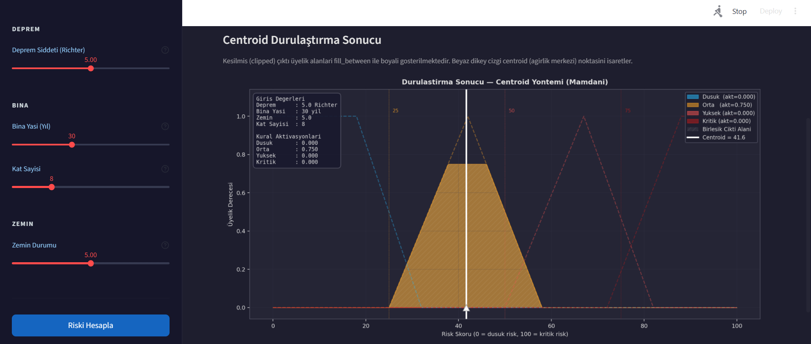
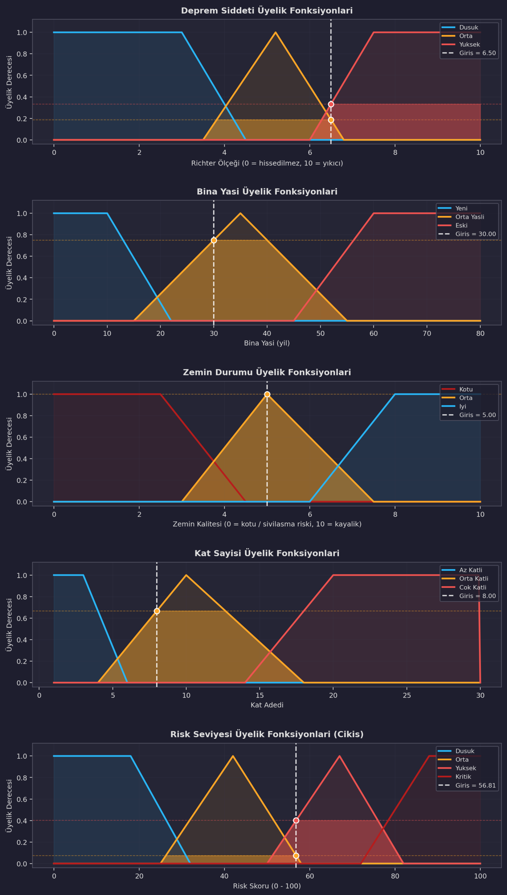
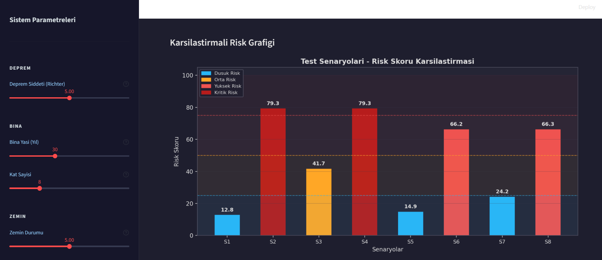
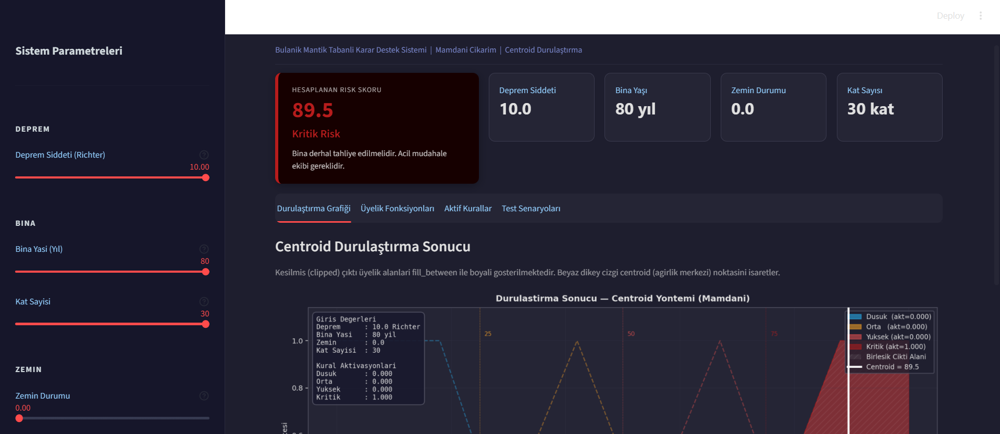

# Deprem Sonrası Acil Risk Değerlendirme Sistemi

Bulanık mantık tabanlı karar destek sistemi kullanılarak geliştirilmiş Streamlit uygulamasıdır.

Bu sistem; deprem şiddeti, bina yaşı, zemin durumu ve kat sayısı parametrelerini değerlendirerek yapıların deprem sonrası risk seviyesini hesaplamaktadır.

---

# Proje Amacı

Bu proje, Bulanık Mantık dersi dönem projesi kapsamında geliştirilmiştir.

Amaç; gerçek dünya problemlerine uygun şekilde:

* bulanıklaştırma,
* üyelik fonksiyonları,
* Mamdani çıkarım mekanizması,
* kural tabanı,
* durulaştırma (centroid)

adımlarını içeren tam bir bulanık kontrolcü sistemi geliştirmektir.

Sistem, klasik kesin kurallar yerine bulanık mantık yaklaşımı kullanarak daha gerçekçi ve esnek sonuçlar üretmektedir.

---

# Kullanılan Teknolojiler

* Python
* Streamlit
* NumPy
* Matplotlib
* SciPy
* scikit-fuzzy

---

# Problem Tanımı

Deprem sonrası yapılarda oluşabilecek risk durumlarının hızlı şekilde değerlendirilmesi oldukça önemlidir.

Klasik sistemlerde risk değerlendirmesi kesin sınırlar ile yapılırken, gerçek dünyada:

* deprem şiddeti,
* bina yaşı,
* zemin kalitesi,
* kat sayısı

birbirleriyle kesin olmayan ilişkiler içerisindedir.

Bu nedenle bulanık mantık yaklaşımı tercih edilmiştir.

---

# Giriş ve Çıkış Değişkenleri

## Giriş Değişkenleri

| Değişken       | Aralık         |
| -------------- | -------------- |
| Deprem Şiddeti | 0 – 10 Richter |
| Bina Yaşı      | 0 – 80 yıl     |
| Zemin Durumu   | 0 – 10         |
| Kat Sayısı     | 1 – 30         |

---

## Çıkış Değişkeni

| Değişken   | Aralık  |
| ---------- | ------- |
| Risk Skoru | 0 – 100 |

---

# Dilsel Tanımlamalar

## Deprem Şiddeti

* Düşük
* Orta
* Yüksek

## Bina Yaşı

* Yeni
* Orta Yaşlı
* Eski

## Zemin Durumu

* Kötü
* Orta
* İyi

## Kat Sayısı

* Az Katlı
* Orta Katlı
* Çok Katlı

## Risk Seviyesi

* Düşük Risk
* Orta Risk
* Yüksek Risk
* Kritik Risk

---

# Kullanılan Yöntemler

## Bulanıklaştırma

Giriş değerleri üyelik fonksiyonları yardımıyla bulanık kümelere dönüştürülmektedir.

---

## Çıkarım Mekanizması

Sistemde Mamdani çıkarım yöntemi kullanılmıştır.

---

## Durulaştırma

Çıkış değeri centroid (ağırlık merkezi) yöntemi ile hesaplanmıştır.


---

# Kural Tabanı

Sistemde toplam 40 adet bulanık mantık kuralı bulunmaktadır.

Kurallar:

* Düşük Risk
* Orta Risk
* Yüksek Risk
* Kritik Risk

şeklinde tasarlanmıştır.

Örnek kurallar:

```python
IF deprem yüksek AND zemin kötü AND bina eski
THEN risk kritik
```

```python
IF deprem düşük AND zemin iyi AND bina yeni
THEN risk düşük
```

```python
IF deprem orta AND zemin kötü AND kat sayısı çok katlı
THEN risk yüksek
```

Ara durumlarda sistemin daha kararlı çalışabilmesi için ek destek kuralları da eklenmiştir.

---

# Arayüz Özellikleri

Sistem arayüzünde:

* Slider ile giriş alma
* Gerçek zamanlı risk hesaplama
* Üyelik fonksiyonları grafikleri
* Aktif kural listesi
* Durulaştırma grafiği
* Test senaryoları karşılaştırma grafiği

bulunmaktadır.

---

# Uygulama Görselleri

## Ana Dashboard



---

## Üyelik Fonksiyonları



---

## Karşılaştırmalı Risk Grafiği



---

## En Yüksek Risk Senaryosu



Bu senaryoda sistem sonucu doğrudan 100 olarak üretmemiştir çünkü durulaştırma işleminde centroid (ağırlık merkezi) yöntemi kullanılmıştır.  

Centroid yöntemi, yalnızca en yüksek risk bölgesine değil; aktif olan tüm risk kümelerine ait alanları birlikte değerlendirerek birleşik alanın ağırlık merkezini hesaplar.  

Bu nedenle sonuç, kritik risk bölgesinde olmasına rağmen doğrudan maksimum değer yerine 89.5 gibi kritik bölgeye yakın bir değer olarak oluşmuştur.

---

# Test ve Değerlendirme

Sistem farklı senaryolar üzerinde test edilmiştir.

Örnek senaryolar:

| Senaryo                        | Sonuç       |
| ------------------------------ | ----------- |
| Yeni bina + iyi zemin          | Düşük Risk  |
| Orta yaşlı bina + orta deprem  | Orta Risk   |
| Yüksek deprem + çok katlı bina | Yüksek Risk |
| Eski bina + kötü zemin         | Kritik Risk |

Karşılaştırmalı grafikler ile sistemin farklı durumlara uygun şekilde farklı risk skorları ürettiği gözlemlenmiştir.

---

# Sistemin Güçlü Yönleri

* Gerçek zamanlı sonuç üretmesi
* Görsel grafik desteği
* Kullanıcı dostu arayüz
* Belirsizlik içeren durumlarda daha gerçekçi karar verebilmesi
* Centroid yöntemi ile dengeli sonuç üretmesi

---

# Sistemin Zayıf Yönleri

* Kurallar manuel olarak oluşturulmuştur.
* Çok fazla giriş değişkeni olduğunda kural sayısı hızlı artmaktadır.
* Gerçek saha verileri ile eğitilmiş bir sistem değildir.

---

# Proje Dosya Yapısı

```text
fuzzy_earthquake_risk/
│
├── app.py
├── fuzzy_system.py
├── plots.py
├── test_scenarios.py
├── requirements.txt
├── README.md
│
└── screenshots/
    ├── dashboard.png
    ├── uyelik_fonksiyonlari.png
    ├── karsilastirmali_risk_grafik.png
    └── en_yuksek_risk.png
```

---

# Projeyi Çalıştırma

## Sanal ortam oluştur

```powershell
python -m venv venv
```

## Sanal ortamı aktif et

```powershell
.\venv\Scripts\Activate.ps1
```

## Kütüphaneleri yükle

```powershell
pip install -r requirements.txt
```

## Streamlit uygulamasını çalıştır

```powershell
streamlit run app.py
```

---

# Sonuç

Bu projede bulanık mantık kullanılarak deprem sonrası yapı risk değerlendirme sistemi geliştirilmiştir.

Sistem, üyelik fonksiyonları, Mamdani çıkarımı ve centroid durulaştırma yöntemlerini kullanarak kullanıcıya görsel ve sayısal sonuçlar sunmaktadır.

Farklı senaryolar üzerinde yapılan testlerde sistemin mantıklı ve tutarlı sonuçlar ürettiği gözlemlenmiştir.

---

# Kaynakça

* scikit-fuzzy Documentation
* Streamlit Documentation
* NumPy Documentation
* Matplotlib Documentation
* Bulanık Mantık Ders Notları

---

# Geliştirici

Muhammet Ali Furkan Karamert

Bilişim Sistemleri ve Teknolojileri
